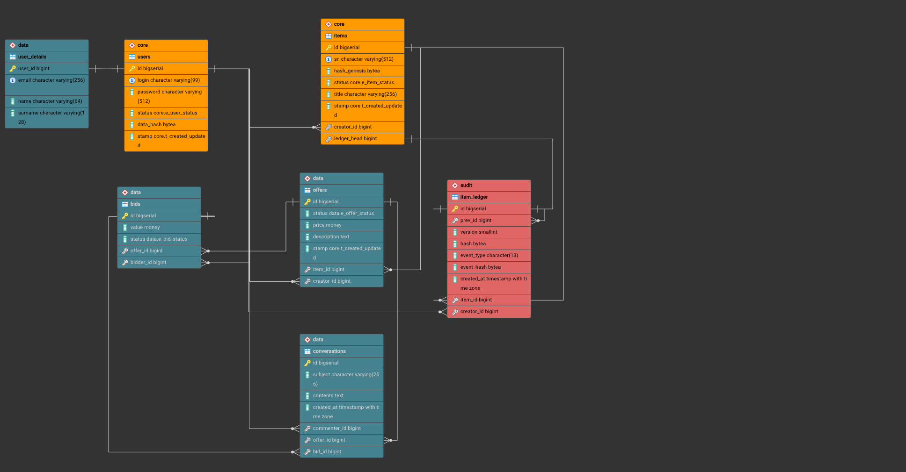

# Database Documentation
## Scope and source of truth

> [!IMPORTANT]
> The `_*.sql` files are generated where applicable (eg. [`_ERD.sql`](../db/_ERD.sql) from the ERD model) and define baseline relational structure.  
> Manual SQL scripts under `db/core`, `db/data`, and `db/audit` define procedural logic, guards, and operational constraints.

---

# ERD specification
## Schemas
- `core` – identity and item ownership domain
- `audit` – immutable-style chain ledger for item events
- `data` – marketplace operations (details, offers, bids, conversations)

## Enumerated / composite types used by ERD
- `core.t_created_updated`
  - tuple used as `(created_at, updated_at)`
- `core.e_user_status`
  - `PENDING` (default), `ACTIVE`, `DELETED`
- `core.e_item_status`
  - `CREATED` (default), `VERIFIED`, `BURNT`
- `data.e_offer_status`
  - `ACTIVE` (default), `RESERVED`, `PENDING_TRANSACTION`, `CLOSED`
- `data.e_bid_status`
  - `PENDING` (default), `CANCELLED`, `FINISHED`

## Tables

### `core.users`
Purpose: platform account identity.

### `data.user_details`
Purpose: profile extension for `core.users` (1:1). Can be purged on deactivation.

### `core.items`
Purpose: item registry by serial number (SN), owned by creator user.

### `audit.item_ledger`
Purpose: append-oriented chain of item history events.

### `data.offers`
Purpose: sale offers bound to item and creator.

### `data.bids`
Purpose: buyer bid records per offer.

### `data.conversations`
Purpose: comments/discussion on offers and bids.

---

## Relationship summary

| Table A | Relation | Table B |
| :-: | :-: | :-: |
| core.users | 1:1 | data.user_details |
| core.users | 1:N | core.items |
| core.items | 1:N | audit.item_ledger |
| core.items | 1:~1 | data.offers |
| data.offers | 1:N | data.bids |
| data.offers | 1:N | data.conversations |
| data.bids | 1:N | data.conversations (optional link) |
| audit.item_ledger | self-chain | prev_id |

---

# Manual SQL logic specification

> [!IMPORTANT]
> The following logic is planned/implemented via hand-written SQL scripts and should not be expected inside ERD-generated DDL.

## `core` logic
Implemented:
- user identity and status lifecycle:
  - `_user_data_hash` (no-side-effect hash helper)
  - `create_user` (creates user + initializes `data.user_details`)
  - `change_user_password`
  - `change_user_email` (hash refresh + details email update)
  - `deactivate_user` (`DELETED`, password deactivation, details cleanup)
- item lifecycle and event emission:
  - `_item_hash` (time-dependent hash helper)
  - `create_item` (genesis hash + initialize audit chain)
  - `change_item_sn` (appends `MOD_ITEM_SN`)
  - `change_item_details` (appends `MOD_ITEM_DETAILS` for title/value)

Planned protections:
- prevent calling private routines (`_...`) directly
- prevent direct `users/items/offers` mutation bypassing API functions
- prevent direct `audit.item_ledger` write operations

## `data` logic
Implemented:
- `user_details` write API:
  - `_init_user_details`
  - `_change_user_email`
  - `change_user_details` (without email)
- constraints:
  - one offer per `(creator_id, item_id)` via composite unique
  - one bid per `(bidder_id, offer_id)` via composite unique
  - `price > 0` via `CHECK`
  - `bid.value >= offer.price` via trigger

Planned:
- `offers`:
  - functions:
    - `register_item_offer`
    - `cancel_item_offer` with cascade cancel of related bids
- `bids`:
  - constraints:
    - cascade bids on offer deletion
  - functions:
    - `place_item_bid`
    - `cancel_item_bid` with status gating
- `conversations`:
  - domain rules for pre/post-bid commenting windows
  - cascade behavior aligned to offer lifecycle

## `audit` logic
Implemented:
- chain/hash routines:
  - `_chain_hash` (no-side-effect)
  - `_init_item_chain`
  - `append_item_event`
- constraints/index guarantees:
  - `uq_IL_standard_prev_id`
  - `uq_IL_genesis_item_id`
- trigger hardening:
  - `trg_protect_item_ledger_update` implemented
  - `trg_protect_item_ledger_delete` implemented
  - `trg_protect_item_ledger_insert` defined but not enabled
- integrity check:
  - `mi_verify_item_chain` returns boolean

> [!CAUTION]
> `item_ledger` protection relies on append-only semantics and chain hash verification for every inserted row.  
> Keep schema-qualified references in triggers/functions (`core.items`, `audit.item_ledger`) to avoid search_path ambiguity.

## `maintenance` logic
Planned:
- cleanup routine:
  - `mc_drop_offers` for stale `CLOSED` offers with cascading bids/conversations deletion
- periodic integrity verification for chain tables

---

## Security and write-path strategy

> [!INFO]
> Business writes should occur through vetted SQL functions only.  
> Direct table DML from application roles should be restricted, especially for:
> - `core.users`
> - `core.items`
> - `data.offers`
> - `audit.item_ledger`

> [!IMPORTANT]
> Event ledger integrity depends on append-only semantics and strict chain validation.  
> Any bypass of function-based write path weakens audit guarantees.
